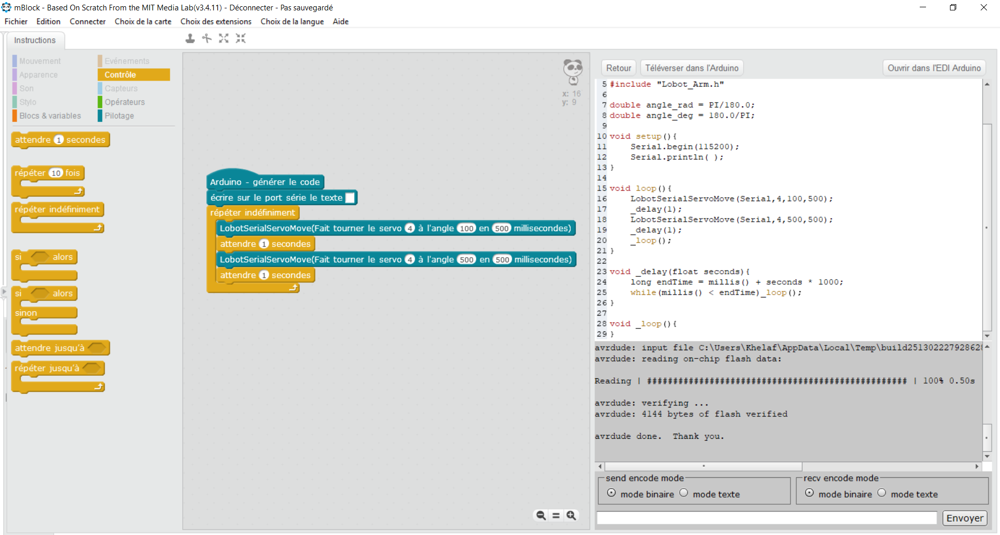

# Extension MBlock driver servo pour la carte LX-16A
Extension pour piloter le(s) servo(s) moteur(s) avec la carte Lewansoul LX-16A pour l'IDE MBlock.
  
Pour l'installer, importer l'extension dans son format ".zip" depuis le gestionnaire d'extensions MBlock.
  

